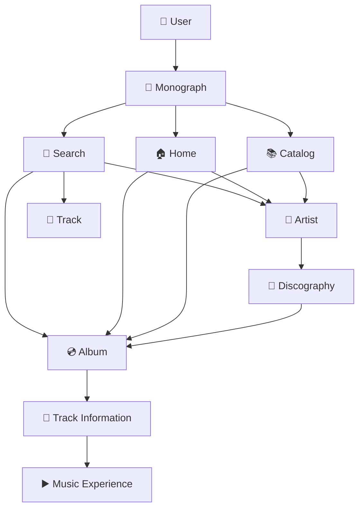
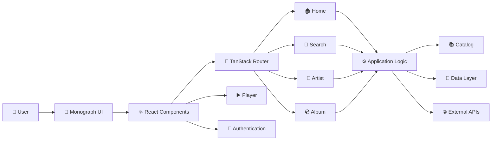

# 🎵 Monograph

> **A modern music discovery and artist information platform** built for exploring artists, albums, tracks, and music catalogs through a clean, responsive, and engaging interface.

Monograph is a modern music discovery web application designed to provide users with an organized and visually rich way to explore music artists, albums, tracks, and related catalog information.

The project focuses on **modern UI design, responsive layouts, reusable components, structured data handling, API integration, authentication, and scalable application architecture**.

---

## ✨ Features

### 🎤 Music Discovery

- Explore music artists and albums
- Search for artists, albums, and tracks
- Browse music catalogs
- View detailed artist information
- Explore album and track information
- Dynamic music content
- Organized discography information

### 🎨 User Experience

- Modern and clean interface
- Responsive design
- Mobile and desktop support
- Smooth navigation
- Interactive UI components
- Modern typography
- Music-focused layouts
- Reusable component architecture

### 🏗️ Application Architecture

- React-based frontend
- TypeScript development
- TanStack Start
- TanStack Router
- Modular component structure
- API/data-service integration
- Authentication architecture
- Environment-based configuration
- Server-side functionality

### 🧑‍💻 Developer Experience

- TypeScript
- React
- Vite
- ESLint
- Prettier
- TanStack ecosystem
- Component-based architecture
- Testing utilities
- Production deployment support

---

## 🛠️ Tech Stack

| Technology | Purpose |
|---|---|
| ⚛️ React | Frontend UI framework |
| 🔷 TypeScript | Type-safe development |
| 🚀 TanStack Start | Full-stack React framework |
| 🧭 TanStack Router | File-based routing |
| ⚡ Vite | Development and build tooling |
| 🎨 Tailwind CSS | Styling |
| 🧩 Radix UI | UI primitives |
| 🔄 TanStack Query | Data/query management |
| 🔐 Better Auth | Authentication |
| 🗄️ Kysely | Database query builder |
| 💾 PGlite | PostgreSQL-compatible local database |
| 🧪 Playwright | Browser testing |
| 🧹 ESLint | Code quality |
| ✨ Prettier | Code formatting |
| 🚀 Vercel | Deployment |

---

# 📂 Project Structure

Monograph follows a modular full-stack React architecture.

## 🧱 High-Level Structure

| Folder / File | Description |
|---|---|
| 📁 `public/` | Static images, icons, and public assets |
| 📁 `src/` | Main application source code |
| 📁 `src/components/` | Reusable React UI components |
| 📁 `src/lib/` | Core application logic and services |
| 📁 `src/routes/` | Application routes and pages |
| 📁 `scripts/` | Development, testing, migration, and deployment scripts |
| 📁 `server/` | Server-side middleware |
| 📁 `migrations/` | Database and authentication migrations |
| 🔐 `.env.example` | Safe environment configuration template |
| 📦 `package.json` | Dependencies and project scripts |
| ⚡ `vite.config.ts` | Vite configuration |
| 🚀 `vercel.json` | Vercel deployment configuration |
| 🔷 `tsconfig.json` | TypeScript configuration |
| 🧹 `eslint.config.mjs` | ESLint configuration |
| 🎨 `.prettierrc` | Prettier configuration |
| 🌐 `index.html` | Application HTML entry point |
| 📖 `README.md` | Project documentation |

## 🧩 Source Code

| Module | Purpose |
|---|---|
| 🎨 `components/` | User interface and reusable components |
| 🗂️ `lib/app-data/` | Application data and readiness management |
| 🔐 `lib/auth/` | Authentication and session management |
| 📚 `lib/catalog/` | Music catalog and data handling |
| 👥 `lib/multiplayer/` | Multiplayer and P2P functionality |
| ▶️ `lib/player-store.ts` | Music player state |
| 🕘 `lib/recents-store.ts` | Recently accessed content |
| 🛠️ `lib/utils.ts` | Shared utility functions |
| 🏠 `routes/index.tsx` | Home page |
| 🔎 `routes/search.tsx` | Search page |
| 🎤 `routes/artist.$id.tsx` | Artist page |
| 💿 `routes/album.$id.tsx` | Album page |
| 🎨 `styles.css` | Global styling |
| 🧭 `router.tsx` | Application router |

<details>
<summary>📁 View detailed source structure</summary>

### 🎨 `src/components/`

- `artist-view.tsx` — Artist information interface
- `media-cards.tsx` — Music/media card components
- `now-playing.tsx` — Current playback interface
- `preview-host-bridge.tsx` — Preview integration
- `providers.tsx` — Application providers
- `search-field.tsx` — Search interface
- `site-chrome.tsx` — Global application chrome
- `ui/` — Reusable UI primitives

### ⚙️ `src/lib/`

- `app-data/` — Application data and readiness
- `auth/` — Authentication functionality
- `catalog/` — Music catalog functionality
- `multiplayer/` — Multiplayer/P2P functionality
- `og/` — Open Graph configuration
- `db.ts` — Database utilities
- `env.server.ts` — Server environment configuration
- `format.ts` — Formatting utilities
- `player-store.ts` — Player state
- `recents-store.ts` — Recent items
- `utils.ts` — Shared utilities

### 🛣️ `src/routes/`

- `__root.tsx` — Root application layout
- `index.tsx` — Home
- `search.tsx` — Search
- `artist.$id.tsx` — Artist details
- `album.$id.tsx` — Album details

### 🧰 `scripts/`

Contains development and operational tooling for:

- Application environment management
- Browser smoke testing
- Authentication checks
- Database migrations
- Preview generation
- PWA configuration
- Deployment utilities

</details>

---

# 🔄 Application Flow

Monograph uses a route-driven music discovery workflow.



## 🧭 User Journey

**1. 👤 User**

The user enters Monograph and lands on the main interface.

**2. 🏠 Home**

The home page provides access to music discovery and catalog content.

**3. 🔎 Search**

Users can search for music-related content.

**4. 🎤 Artist**

Selecting an artist opens the artist information and discography experience.

**5. 💿 Album**

Users can open individual albums and explore their information.

**6. 🎵 Tracks**

Album and artist pages expose available track information.

**7. ▶️ Music Experience**

The player interface provides the application's music playback experience.

---

# 🛣️ Application Routes

| Route | Page | Purpose |
|---|---|---|
| `/` | 🏠 Home | Main Monograph experience |
| `/search` | 🔎 Search | Search music content |
| `/artist/:id` | 🎤 Artist | Artist information and discography |
| `/album/:id` | 💿 Album | Album information and tracks |

---

# 🏛️ Application Architecture



---

# 🧩 Core Modules

## 🎤 Artist Module

Provides artist-focused information including:

- Artist profiles
- Artist metadata
- Discography
- Albums
- Tracks
- Related music information

## 💿 Album Module

Provides album-level information including:

- Album title
- Artist
- Release information
- Track listings
- Album artwork
- Related music information

## 🔎 Search Module

Allows users to discover music content through search.

Supported music entities include:

- 🎤 Artists
- 💿 Albums
- 🎵 Tracks

## 📚 Catalog Module

Provides structured access to available music content and enables users to browse music information in an organized manner.

## ▶️ Music Player

The music player architecture provides the foundation for music-oriented interactions and playback-related functionality.

---

# 🔐 Authentication

Monograph includes an authentication architecture for handling user-specific functionality.

Authentication-related functionality is organized under:

```text
src/lib/auth/
```

It includes:

- Authentication providers
- Email/password authentication
- Session handling
- Identity management
- Authentication gates
- Middleware
- User state
- Verification

### 🚨 Never Commit

```text
.env
.env.local
.env.production
Private keys
API secrets
Client secrets
Access tokens
Private credentials
Deployment credentials
```

Only `.env.example` should be included in the public repository.

---

# 🚀 Installation

## 1️⃣ Clone the Repository

```bash
git clone https://github.com/akshatwins/monograph.git
```

## 2️⃣ Enter the Project

```bash
cd monograph
```

## 3️⃣ Install Dependencies

```bash
npm install
```

## 4️⃣ Configure Environment Variables

Create a local environment file:

```bash
cp .env.example .env
```

Add the required configuration values to `.env`.

## 5️⃣ Start Development Server

```bash
npm run dev
```

The development URL will be displayed by the local Vite/TanStack development server.

---

# 📜 Available Scripts

| Command | Description |
|---|---|
| `npm run dev` | ⚡ Start development server |
| `npm run build` | 📦 Create production build |
| `npm run preview` | 👀 Preview production build |
| `npm run lint` | 🧹 Run ESLint |

---

# 🔑 Environment Variables

Monograph uses environment variables for configuration that should not be exposed directly in source control.

Use `.env.example` as the reference for required variables.

Example:

```env
VITE_API_URL=
VITE_CLIENT_ID=
VITE_PUBLIC_KEY=
```

### 🛡️ Security Best Practices

Never place private credentials directly inside frontend source code.

If a credential is accidentally committed:

1. 🔄 Revoke or rotate the credential
2. 🗑️ Remove it from the repository
3. 🔐 Update the environment configuration
4. 🔍 Check Git history if necessary

---

# 📱 Responsive Design

Monograph is designed for:

- 📱 Mobile
- 📲 Tablet
- 💻 Laptop
- 🖥️ Desktop

The interface uses responsive layouts and reusable components to maintain usability across different screen sizes.

---

# 🧪 Testing

The project includes browser and application testing utilities.

Testing-related tooling can be found within:

```text
scripts/
```

and the project's configured testing dependencies.

Before deployment, run:

```bash
npm run lint
npm run build
```

---

# 🌐 Deployment

Monograph is structured for modern web deployment.

Supported deployment platforms can include:

- 🚀 Vercel
- 🌐 Netlify
- ☁️ Cloudflare Pages

### 🚀 Deployment Flow

```text
🐙 GitHub Repository
        ↓
🚀 Deployment Platform
        ↓
📦 Production Build
        ↓
🎵 Monograph
```

Environment variables must be configured separately on the deployment platform.

---

# ✅ Production Checklist

Before deploying Monograph:

- [ ] 🔐 Remove development credentials
- [ ] ⚙️ Configure production environment variables
- [ ] 🌐 Verify API configuration
- [ ] 🧹 Run `npm run lint`
- [ ] 📦 Run `npm run build`
- [ ] 📱 Test mobile responsiveness
- [ ] 🔎 Test search functionality
- [ ] 🎤 Test artist pages
- [ ] 💿 Test album pages
- [ ] 🔐 Test authentication
- [ ] 🌐 Verify production API requests
- [ ] 🛡️ Confirm no secrets are committed

---

# ⚡ Performance

The project follows modern web-development practices including:

- 🧩 Reusable components
- 📦 Modular code organization
- ⚡ Production bundling
- 🖼️ Optimized asset handling
- 📱 Responsive layouts
- 🌐 Efficient data fetching
- 🔐 Environment-based configuration

---

# 🗺️ Future Improvements

Potential future development areas include:

- 🤖 Personalized music recommendations
- 📊 Advanced artist analytics
- 👤 User profiles
- ❤️ Favorites and playlists
- 🕐 Listening history
- 🔎 Advanced search filters
- 📈 Music charts
- ⚖️ Artist comparison
- 🌓 Dark/light themes
- 📱 Progressive Web App support
- ⚡ Improved caching
- 🔌 Additional API integrations
- 🧪 Automated testing
- 🔄 CI/CD pipeline

---

# 📌 Project Status

### 🟢 Active Development

Monograph is being developed as a modern music discovery and information platform with a focus on:

- 🎨 Modern UI/UX
- 📱 Responsive design
- 🎵 Music discovery
- 🌐 API integration
- 🏗️ Scalable architecture
- ⚡ Performance
- 🔐 Secure configuration

---

# 👨‍💻 Author

### Akshat Lohar

🎓 Data Science & Software Development

🇮🇳 India

🐙 GitHub: [akshatwins](https://github.com/akshatwins)

---

# 📄 License

This project is currently intended for educational, portfolio, and development purposes.

If you plan to distribute or open-source the project, add an appropriate license such as MIT, Apache-2.0, or another license suitable for your intended use.

---

# ⚠️ Disclaimer

Monograph is an independent software project.

Music metadata, artwork, artist information, and other third-party content may be provided through external services or APIs. Their respective names, trademarks, artwork, and content remain the property of their respective owners.

Monograph does not claim ownership of third-party music catalogs or copyrighted materials.

---

# ⭐ Support

If you find **Monograph** useful or interesting, consider giving the repository a ⭐ on GitHub.

```text
╔══════════════════════════════════════╗
║             🎵 MONOGRAPH             ║
║                                      ║
║     Artists • Albums • Tracks        ║
║            • Discovery               ║
╚══════════════════════════════════════╝
```

### 🎵 Monograph

**Discover the music. Explore the artists.**
